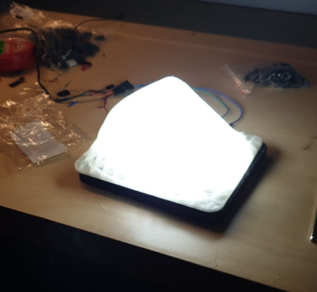
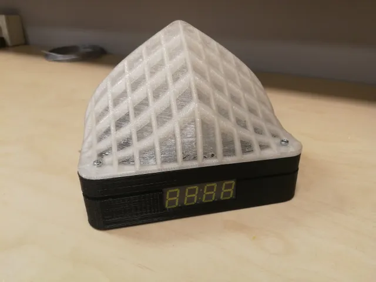
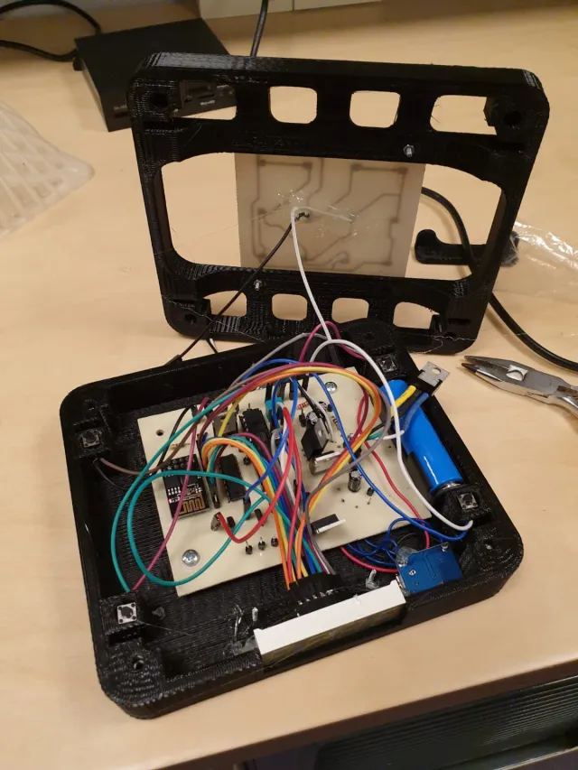

    <h1>🌍 Custom Web Server with ESP8266 For Wifi Controlled Lamp 📡</h1>
    

        Transform your microcontroller into a dynamic web server leveraging the power of ESP8266.
    

    
    

---

## 🚀 Features:

- **🌐 Robust Web Server**: Serve pristine HTML pages seamlessly from your microcontroller to any client connecting to the ESP8266's IP.
  
- **🔧 Serial Insights**: Real-time debug information broadcasted on your serial monitor, making troubleshooting a breeze.
  
- **🔗 Dynamic Connection Flow**: Smartly juggle multiple clients with our efficient dynamic stack data structure.

---

    
    
    

## 📖 Detailed Functions:

- `getReply3(int wait)`: Listens intently for a stipulated time, echoing all `Serial3` data.
  
- `loadPacket(char *packet, int len, int clientId)`: Dedicatedly sends data packets to the chosen client.
  
- `loadHTML(int clientId)`: Craftily dispatches the HTML ensemble to the designated client.
  
- `breakConnection(int clientId)`: Gracefully concludes the client-server dance.
  
- `setup()`: Prepares the ESP8266 stage, spotlighting it as your web server star.
  
- `loop()`: The vigilant sentinel, always on the lookout for connections, eagerly serving HTML treasures upon demand.

---

## 🧠 Classes:

- `dynamicStack`: Our prized utility class—stack operations have never been this smooth, ensuring impeccable client management.

---

## 📚 Prerequisites:

- **💡 Hardware**: A passionate microcontroller (like Arduino) paired with the talented ESP8266 WiFi module.
  
- **🖥 Software**: Arduino IDE or its gifted cousins.
  
- **📦 Dependencies**: The trusty default Arduino libraries.

---

## 🛠 Getting Started:

1. **Inscribe**: Fill the `htmlCode` with the poetic HTML you wish to broadcast.
2. **Awaken**: Upload the spell (code) to your microcontroller.
3. **Connect**: Join the ESP8266's magical WiFi realm or align the ESP8266's energies with your device's network aura.
4. **Discover**: Send forth a quest (request) to the ESP8266's IP portal through your web browser.
5. **Revel**: Bask in the magnificence of the `htmlCode` web page.

---

## 📌 Additional Notes:

- **Caution**: The `htmlCode` story should respect the boundaries set by the `SIZE` guardian.
  
- **Harmony**: The innate rhythm (baud rate) for serial duets is 115200 for both the microcontroller and the ESP8266 (Serial3). Feel free to adjust to your tune.

---

    <b>Contributions</b>: 🌟 Your ideas can paint the sky! 🌟 Fork, enhance, and propose your changes. Bless us with bug tales or feature dreams in the issues sanctuary.

